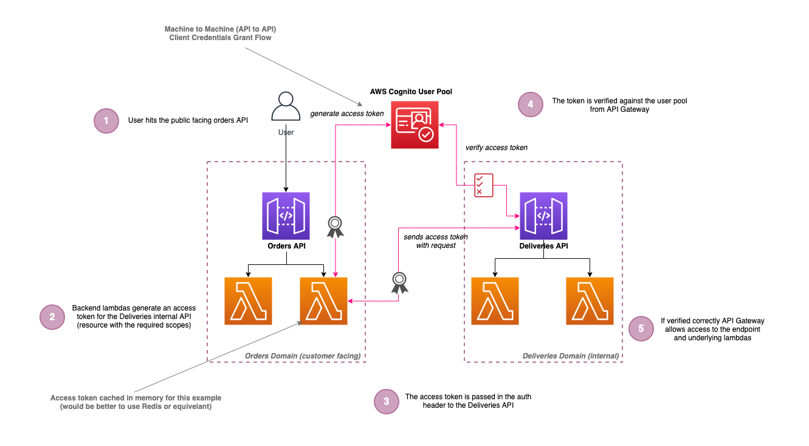

# serverless-api-to-api-auth

## Introduction

Example of serverless internal api to api authentication/authorisation using Cognito's client credentials grant flow, based on the following [blog post](/)

In the Serverless World, there are always situations when developing solutions that two or more internal APIs need to communicate with each other. The gold standard would be totally decoupled domain services using events, but in reality, there are often reasons why you need a machine to machine style communication using REST.

This repo covers using the OAuth2 Credentials Grant flow to authenticate APIs (machines) rather than users, using AWS Cognito, API Gateway, AWS Lambda, and TypeScript, hosted in a Lerna monorepo for ease of the demo.

## What are we building?

The following diagram below shows what we are building in this repo:

## Deploying

🛑 **Note**: Running the following commands will incur charges on your AWS account so change the config accordingly.

In the base of the repo run `npm i` and then `npm run bootstrap` (_this will install the dependencies and then bootstrap Lerna_)

Once completed steps above, run the following command `npm run deploy:develop` in each of the folders in order:

1. `./apps/auth-service`
2. `./apps/deliveries`
3. `./apps/orders`

## Tearing Down

To remove the services please run the following `npm run remove:develop` in each of the folders in order:

1. `./apps/orders`
2. `./apps/deliveries`
3. `./apps/auth-service`

## Testing

Use the Postman file in the `./postman/` folder to test the endpoints, logging into the CloudWatch console to view the output for the lambdas to see how this is all working correctly.

This is covered in more detail in the associated blog post.

**\***\* The information provided are my own personal views and I accept no responsibility on the use of the information. \*\*\*\*\*\*
